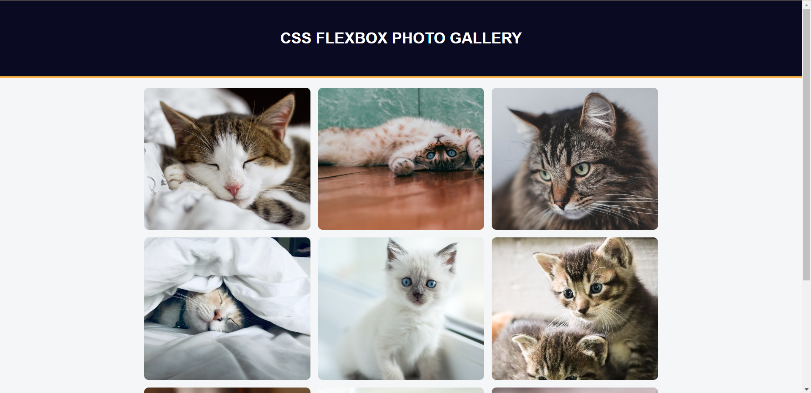

# CSS Flexbox Photo Gallery

## Overview

The CSS Flexbox Photo Gallery is a responsive web gallery designed using CSS Flexbox. It allows you to display a collection of images in an organized and visually appealing manner. This gallery is responsive and adapts to different screen sizes, making it suitable for various devices.

## Technologies Used

- HTML5
- CSS3 (Flexbox)

## Features

- **Flexbox Layout**: The gallery layout is built using CSS Flexbox, which simplifies the arrangement of images in a grid-like fashion.

- **Responsive**: The gallery is designed to be responsive, ensuring that it looks great on both desktop and mobile devices.

- **Image Styling**: Images in the gallery are styled with a maximum width, height, and rounded corners to enhance the visual appeal.

## How to Use

To view the CSS Flexbox Photo Gallery, follow these steps:

1. Clone this repository to your local machine.
2. Open the `index.html` file in a web browser.

You can also customize the gallery by replacing the image sources in the HTML with your own images and adjusting the CSS to match your preferred styling.

## Author

- [Chosen Esiwe]
- GitHub: [Your GitHub Profile](https://github.com/Choboy-dev)

## License

This project is licensed under the MIT License - see the [LICENSE](LICENSE) file for details.

Enjoy creating and showcasing your own photo gallery using CSS Flexbox!